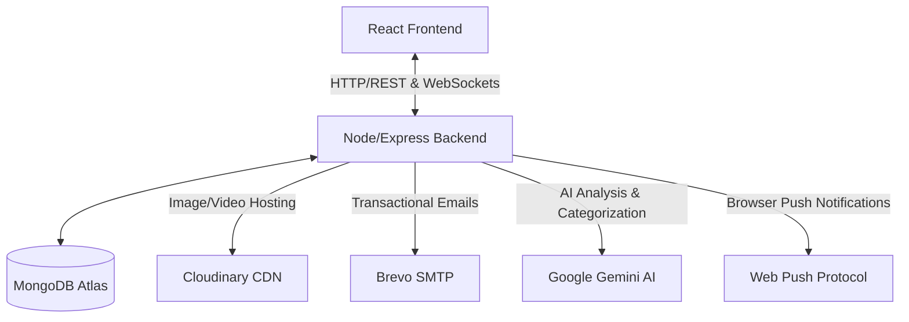

# 📐 System Architecture

This document describes the high-level architecture, data flows, and integrations of the GreenAlert application.

## 🚀 Overview

GreenAlert is a multi-role, real-time web application built on a decoupled **Client-Server** architecture.

---

## 🔑 Role-Based Access Control (RBAC)

GreenAlert enforces security and dashboard isolation based on three distinct user roles:

1. **Citizen:** The everyday user. Can log issues, participate in community discussions, vote on local polls, view the interactive map, and earn XP/Achievements.
2. **Agency:** Environmental protection or sanitation entities. Assigned to reports within their jurisdiction. Can update status (`Pending`, `In Progress`, `Resolved`) and coordinate cleanup details.
3. **Admin:** Platform managers. Monitor platform health, manage users and agencies, access overall statistics, toggle maintenance mode, and broadcast announcements.

---

## 🔄 Core Data Flows

### 1. Incident Reporting Pipeline
When a citizen reports an environmental hazard:
1. **Upload Evidence:** The client uploads media directly (or via the backend) to **Cloudinary**, obtaining a secure CDN URL.
2. **Post Details:** The client sends the details (title, description, location, media URL) to `/api/reports`.
3. **Gemini AI Evaluation:** The backend intercepts the post and queries **Google Gemini AI**:
   - Assesses the severity (Low, Medium, High, Critical).
   - Validates coordinates and auto-categorizes the incident.
   - Detects potential duplicates within the geographic vicinity.
4. **Persist and Notify:** The record is saved to **MongoDB**. Immediate real-time broadcast is sent via **Socket.io** to online agencies, and browser notifications are pushed to nearby citizens if subscribed.

### 2. Live Incident Resolution Updates
1. **Update Request:** An agency worker opens a report and changes status to `In Progress` or `Resolved`.
2. **State Transition:** The database updates the report record.
3. **Real-time Alert:**
   - **Socket.io** instantly pushes the updated report status to the citizen's dashboard.
   - **Web Push** triggers a native system/mobile popup alert to the reporting citizen even if their browser tab is closed.

---

## 🔌 Socket.io Real-time Infrastructure

Real-time actions are managed through events on the Socket server:
- **`connection`:** Authenticates user via socket headers.
- **`join:room`:** Rooms are dynamically created for specific reports, chat rooms, and agency jurisdictions.
- **`report:status-change`:** Emitted when reports transition from one state to another.
- **`chat:message`:** Used for the real-time community chat or reporting updates.
